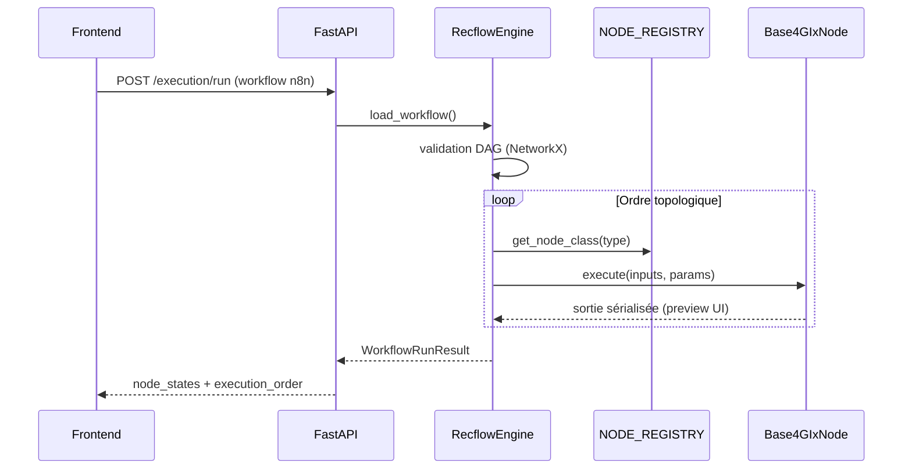

# Rapport de structure — 4GIx (initialisation)

Généré pour analyse du socle technique v0.1.

## 1. Vue d’ensemble

| Couche | Technologie | Rôle |
|--------|-------------|------|
| Infra | Docker Compose | PostGIS 15, backend Python 3.11, frontend Vite |
| Backend | FastAPI + NetworkX | API REST/WS, exécution DAG format n8n |
| Données | Pandas / Polars / GeoPandas / Shapely | Tabulaire + spatial |
| Frontend | React 18 + @xyflow/react + MapLibre | Canvas workflow + inspection 3 fenêtres + carte |

## 2. Arborescence effective

```
4gix/
├── docker/
│   ├── docker-compose.yml
│   └── postgis/init.sql
├── backend/
│   ├── Dockerfile
│   ├── requirements.txt
│   └── app/
│       ├── main.py
│       ├── core/
│       │   ├── config.py
│       │   └── recflow_engine.py
│       ├── nodes/
│       │   ├── base.py              # Base4GIxNode
│       │   ├── registry.py
│       │   ├── serialization.py
│       │   ├── readers/             # postgis, file, geojson
│       │   ├── transformers/        # select_fields, reproject
│       │   └── writers/             # geojson, postgis
│       └── api/
│           ├── execution.py
│           └── nodes_catalog.py
├── frontend/
│   ├── Dockerfile
│   ├── package.json
│   └── src/
│       ├── App.tsx
│       ├── store/workflowStore.ts
│       └── components/
│           ├── Canvas/WorkflowCanvas.tsx
│           ├── NodeModal/           # Input, Config, Output
│           └── MapViewer/MapViewer.tsx
├── doc/STRUCTURE_REPORT.md
└── README.md
```

## 3. Flux d’exécution (backend)



## 4. Modèle de nœud

- **Contrat** : `Base4GIxNode` avec `node_type`, `category`, `is_spatial`, `execute(inputs, params)`.
- **Registre** : `NODE_REGISTRY` dans `registry.py` (7 nœuds de démonstration).
- **Sortie UI** : `serialization.py` produit `kind`, `preview`, `row_count`, etc. ; le `payload` (DataFrame/GeoDataFrame) reste côté serveur.

## 5. Format workflow (n8n)

- **nodes** : `id`, `name`, `type` (ex. `4gix.readers.geojson`), `position`, `parameters`.
- **connections** : clé = nom du nœud source, `main[outputIndex][]` → `{ node, type, index }`.

Le store frontend (`workflowStore.ts`) convertit React Flow → JSON n8n via `toN8nWorkflow()`.

## 6. Catalogue des nœuds (v0.1)

| Type | Catégorie | Spatial |
|------|-----------|---------|
| `4gix.readers.postgis` | Reader | oui |
| `4gix.readers.file` | Reader | non |
| `4gix.readers.geojson` | Reader | oui |
| `4gix.transformers.select_fields` | Transformer | non |
| `4gix.transformers.reproject` | Transformer | oui |
| `4gix.writers.geojson` | Writer | oui |
| `4gix.writers.postgis` | Writer | oui |

## 7. Recflow (clarification)

- `requirements.txt` inclut le paquet PyPI `recflow` (RecommendFlow / ML).
- Le moteur actuel **`RecflowEngine`** implémente l’orchestration DAG 4GIx (NetworkX + registre) et capture les états intermédiaires pour l’UI.
- Une future itération pourra brancher un runtime Recflow ETL dédié sans changer le contrat API `workflow` n8n.

## 8. Points ouverts (sprints suivants)

1. Formulaires dynamiques Config (fenêtre 2) depuis schéma JSON par `node_type`.
2. Liaison carte ↔ géométries de la fenêtre Output.
3. Persistance workflows / runs dans PostGIS (`schema gix`).
4. Auth multi-tenant et files d’exécution.
5. Remplacement ou encapsulation du stub PyPI `recflow` si un moteur interne `4gix-recflow` est publié.

## 9. Commandes de validation

```bash
# Arborescence
cd 4gix && find . -type f | sort

# Stack complète
cd 4gix/docker && docker compose config

# Build frontend
cd 4gix/frontend && npm install && npm run build
```
